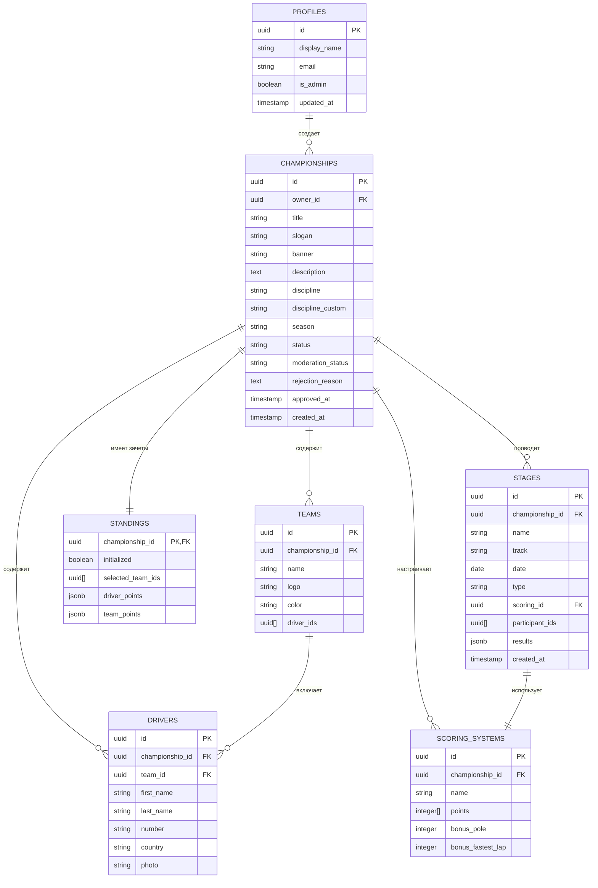
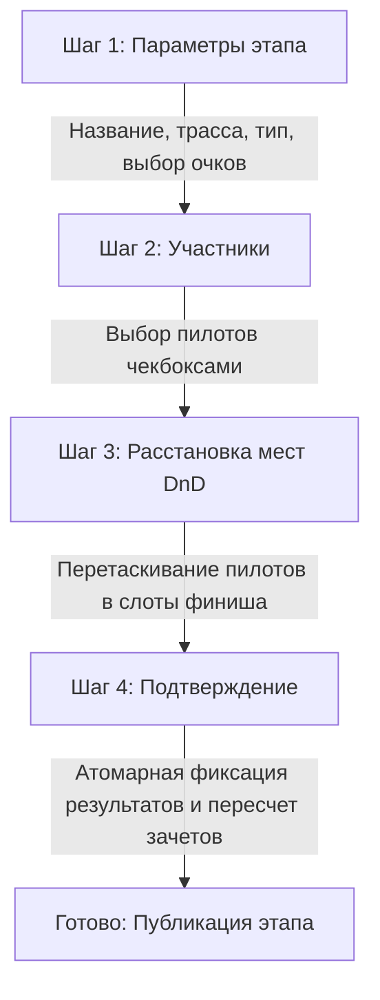

# Документация проекта LMERC

Добро пожаловать в проект **LMERC** — современную интерактивную веб-платформу для управления киберспортивными и реальными чемпионатами по автоспорту. Проект разработан как аналог сервиса *challenge.place*, но имеет уникальный визуальный стиль, гибкую систему очков и глубокую интеграцию с Supabase.

---

## 🏗 Архитектура и Структура проекта

Приложение построено по модульной структуре на базе **React 18**, **Vite** и **TypeScript**.

### Структура директорий
```text
LMERC/
├── .env.example            # Шаблон переменных окружения
├── postcss.config.js       # Конфигурация PostCSS
├── tailwind.config.js      # Конфигурация Tailwind CSS
├── tsconfig.json           # Настройки TypeScript
├── vercel.json             # Настройки деплоя на Vercel (Edge-функции)
├── vite.config.ts          # Конфигурация Vite
├── api/                    # Vercel Serverless/Edge функции
│   └── share/
│       └── [id].ts         # Edge-функция для генерации Open Graph мета-тегов
├── supabase/
│   └── migrations/
│       └── 0001_init.sql   # SQL-миграция для инициализации БД
└── src/
    ├── App.tsx             # Корневой компонент приложения
    ├── main.tsx            # Точка входа React
    ├── types.ts            # Глобальные TypeScript типы
    ├── router.tsx          # Клиентский Hash-роутер
    ├── index.css           # Глобальные стили и переменные тем
    ├── components/         # Общие компоненты интерфейса
    │   ├── layout/         # Шапка, подвал и общая разметка (Header, HeroVideoBackground)
    │   ├── toast/          # Контекст и UI для всплывающих уведомлений (ToastContext)
    │   └── ui/             # Базовые UI элементы (Button, Input, Modal, Avatar, Crop и др.)
    ├── hooks/              # Пользовательские хуки (useAuth, useTheme, useSupabaseQuery)
    ├── lib/                # Вспомогательные библиотеки и вычисления
    │   ├── api/            # API-слой для взаимодействия с Supabase (championships, teams, drivers и др.)
    │   ├── countries.ts    # Справочник стран с ISO кодами
    │   ├── database.types.ts # Сгенерированные типы базы данных Supabase
    │   ├── id.ts           # Генератор UUID
    │   ├── image.ts        # Обработка и сжатие изображений перед загрузкой
    │   ├── scoring.ts      # Вспомогательные функции для подсчета очков
    │   ├── standingsCalc.ts # Логика пересчета личного и командного зачетов
    │   ├── storage.ts      # Функции работы с Supabase Storage (бакеты)
    │   └── supabase.ts     # Инициализация Supabase Client
    ├── features/           # Функциональные модули
    │   ├── auth/           # Компоненты авторизации и OTP (AuthModal, UserMenu)
    │   ├── championship/   # Логика и формы чемпионатов (ChampionshipCard, CreateChampionshipModal, SettingsTab)
    │   ├── drivers/        # Модальное окно управления пилотами (DriverModal)
    │   ├── scoring/        # Управление системами начисления очков (ScoringTab)
    │   ├── stages/         # Мастер проведения этапа (Wizard) и история результатов
    │   ├── standings/      # Отображение таблиц зачетов с анимациями (DriversTable, TeamsTable, StandingsInitTab)
    │   └── teams/          # Управление командами и пилотами (TeamsTab, TeamModal с Drag-and-Drop)
    └── pages/              # Страницы приложения
        ├── Landing.tsx             # Главная страница (лендинг и список чемпионатов)
        ├── Account.tsx             # Личный кабинет организатора
        ├── AdminPanel.tsx          # Панель администратора (модерация чемпионатов)
        ├── ChampionshipPublic.tsx  # Публичная страница чемпионата (таблицы, этапы, участники)
        └── ChampionshipManage.tsx  # Панель управления конкретным чемпионатом (для владельца)
```

---

## 🎨 Визуальная Идентичность и Стилизация

В LMERC реализован премиальный дизайн с поддержкой тёмного и светлого режимов (переключение в шапке). Тёмный режим является темой по умолчанию.

### Цветовая палитра (CSS-переменные в `src/index.css`)

| Токен | Тёмная тема | Светлая тема | Назначение |
| :--- | :--- | :--- | :--- |
| `--lime-primary` | `198 255 0` (Lime #C6FF00) | `132 175 0` | Кнопки действия (CTA), активные элементы, акценты |
| `--lime-dark` | `168 217 0` | `105 140 0` | Hover-состояния, бордеры |
| `--lime-muted` | `212 255 77` | `168 217 0` | Подсветки, бейджи, теги |
| `--ink-deep` | `10 10 10` (Черный) | `250 250 250` | Основной фон страниц |
| `--ink-card` | `17 17 17` | `255 255 255` | Фоновый цвет карточек |
| `--ink-elevated` | `26 26 26` | `245 245 245` | Модальные окна, сайдбары |
| `--ink-surface` | `34 34 34` | `240 240 240` | Поля ввода, таблицы |
| `--ink-border` | `42 42 42` | `224 224 224` | Тонкие разделители и рамки |
| `--danger` | `255 59 48` (Красный) | `215 38 30` | Ошибки, деструктивные операции |
| `--success` | `52 199 89` (Зеленый) | `30 142 62` | Успешные операции, подтверждения |

### Шрифты
*   Основной шрифт: **TikTok Sans** (подключен из Google Fonts, веса 300–900). Обеспечивает отличную читаемость таблиц и числовых данных.
*   Кастомные стили трекинга текста (разреженности):
    *   `.tracking-display` (2px) — для заголовков чемпионатов
    *   `.tracking-section` (1.5px) — для разделов меню
    *   `.tracking-badge` (1px) — для мелких ярлыков и подписей

---

## 🛢 Схема данных Supabase (PostgreSQL)

База данных построена в Supabase с включенной политикой безопасности **Row Level Security (RLS)** для защиты данных пользователей.

### Диаграмма связей данных (Entity-Relationship)



### Безопасность RLS (Row Level Security)
1.  **Profiles**:
    *   Чтение: Доступно любому аутентифицированному пользователю.
    *   Запись/Обновление: Только владелец профиля (`auth.uid() = id`).
2.  **Championships**:
    *   Чтение: Только одобренные (`moderation_status = 'approved'`), либо владельцу чемпионата, либо администратору.
    *   Создание: Люгой аутентифицированный пользователь.
    *   Обновление: Только владелец чемпионата (`owner_id = auth.uid()`) или администратор.
3.  **Другие таблицы** (`teams`, `drivers`, `stages`, `standings`):
    *   Чтение: Публичное (для отображения результатов).
    *   Запись/Обновление: Только владельцу соответствующего чемпионата (проверяется через `championships.owner_id`) или администратору.

---

## ⚡️ Функциональные возможности по шагам

### 1. Авторизация и Роли
*   Вход реализован по беспарольному коду (**Email OTP**). Пользователю на почту приходит 6-значный код подтверждения.
*   При первом входе автоматически создаётся профиль в `profiles`.
*   Администратор сайта назначается вручную в БД флагом `is_admin = true`. Администратор имеет доступ к специальной панели `/admin` для модерации создаваемых чемпионатов.

### 2. Модерация Чемпионатов
*   При создании чемпионата организатором он переходит в статус `pending` и не отображается на главной странице.
*   Администратор в своей панели видит список заявок на модерацию и может:
    *   **Одобрить**: статус меняется на `approved`, чемпионат становится публичным.
    *   **Отклонить**: статус меняется на `rejected`, указывается текстовая причина отклонения. Организатор видит её в своём кабинете.

### 3. Управление Командами и Пилотами (DnD)
*   **Drag-and-Drop**: Интерфейс на базе `@dnd-kit/core` позволяет перетаскивать пилотов между командами на интерактивной доске.
*   Существует зона «Без команды» для свободных пилотов.
*   Все изменения пилотов и команд синхронизируются с Supabase в реальном времени.

### 4. Мастер проведения этапа (Stage Wizard)
Проведение этапа состоит из 4 интерактивных шагов:



*   **Атомарность**: При сохранении результатов этапа для каждого пилота фиксируется его `teamId` на момент проведения гонки. Это гарантирует, что если пилот позже сменит команду, исторические очки командного зачета останутся корректными, а при откате (удалении) этапа баланс очков вернется в исходное состояние.

### 5. SEO и Социальный шеринг (Open Graph)
Для одностраничного приложения (SPA) на базе хэш-роутинга реализована бесшовная поддержка превью при публикации ссылок в соцсетях и мессенджерах:
*   **Edge-функция Vercel** ([[id].ts](file:///c:/Users/Алексей/Desktop/LMERC/api/share/[id].ts)): Перехватывает запросы по адресу `/api/share/[id]`.
*   **Динамическая генерация OG-тегов**: Функция запрашивает данные о чемпионате из Supabase, на лету формирует HTML с мета-тегами (`og:title`, `og:description`, `og:image`) и отдаёт поисковым роботам и мессенджерам.
*   **Редирект на клиентский роут**: Обычные пользователи мгновенно перенаправляются на соответствующий хэш-роут (`#/championship/${id}/overview`) с помощью HTTP Refresh заголовка и клиентского JavaScript-скрипта.

---

## 🚀 Быстрый старт

### Требования
*   Установленная **Node.js** (версии 18 и выше)
*   Аккаунт **Supabase**

### Настройка проекта локально

1.  **Клонирование и установка зависимостей**:
    ```bash
    npm install
    ```

2.  **Настройка окружения**:
    Создайте файл `.env` в корневом каталоге (скопировав `.env.example`) и укажите ваши ключи Supabase:
    ```env
    VITE_SUPABASE_URL=https://your-project-id.supabase.co
    VITE_SUPABASE_ANON_KEY=your-supabase-anon-key
    ```

3.  **Инициализация базы данных**:
    *   Перейдите в консоль Supabase -> **SQL Editor**.
    *   Создайте новый запрос и выполните содержимое файла `supabase/migrations/0001_init.sql`. Это создаст все необходимые таблицы, триггеры, функции и настроит политики RLS.

4.  **Создание Storage Buckets**:
    Перейдите в раздел **Storage** в Supabase и создайте три публичных бакета:
    *   `banners` (для баннеров чемпионатов)
    *   `logos` (для логотипов команд)
    *   `photos` (для фотографий пилотов)
    *   *Убедитесь, что бакеты имеют статус **Public**, чтобы изображения были доступны гостям.*

5.  **Включение Realtime**:
    Для мгновенного обновления таблиц у всех пользователей включите **Realtime** для следующих таблиц в панели Supabase (Database -> Replication -> Source):
    *   `championships`
    *   `teams`
    *   `drivers`
    *   `scoring_systems`
    *   `standings`
    *   `stages`

6.  **Запуск локального сервера**:
    ```bash
    npm run dev
    ```
    Приложение запустится по адресу: [http://localhost:5173](http://localhost:5173).

---

## 🛠 Полезные команды для разработки

*   `npm run dev` — запуск локального dev-сервера с hot-reload.
*   `npm run build` — сборка проекта для продакшена (включает проверку типов TypeScript).
*   `npm run preview` — локальный запуск собранного дистрибутива из папки `dist`.

---

## 📈 Бэклог и Идеи для развития (Roadmap)

> [!NOTE]
> Список задач для будущих итераций разработки:

*   [ ] **Генерация сетки кубковых соревнований (Playoffs)**: Добавление сетки на выбывание (1/8, 1/4, полуфиналы, финал) для турниров по картингу или дуэльных заездов.
*   [ ] **Интеграция с внешними симуляторами**: API для автоматического импорта результатов заездов (JSON/CSV) из Assetto Corsa Competizione, iRacing или F1 23/24.
*   [ ] **Поддержка командных экипажей**: Возможность назначать нескольких пилотов на одну машину (актуально для гонок на выносливость Endurance).
*   [ ] **Детальная статистика пилотов**: Графики динамики позиций в чемпионате, тепловые карты финишей, сравнение напарников по команде.
*   [ ] **Уведомления**: Telegram-бот для рассылки новостей об изменениях в турнирной таблице и анонсов этапов.
