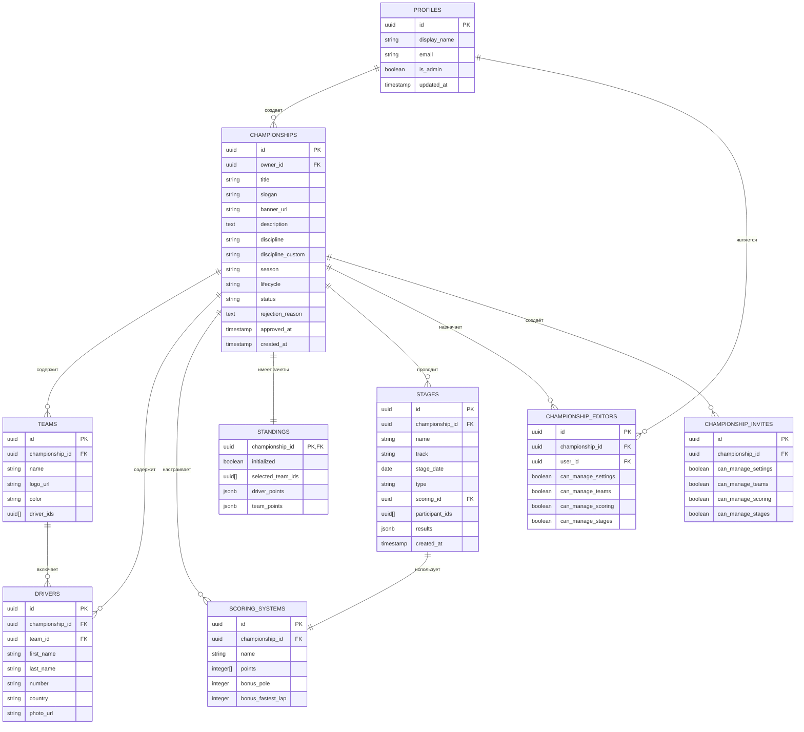
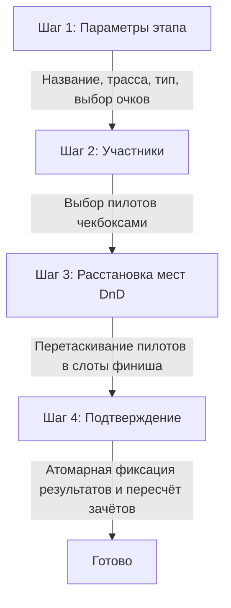

# Документация проекта LMERC

Современная интерактивная веб-платформа для управления киберспортивными и реальными чемпионатами по автоспорту. Аналог *challenge.place* с уникальным визуальным стилем, гибкой системой очков и глубокой интеграцией с Supabase.

---

## Стек технологий

| Слой | Технологии |
| :--- | :--- |
| **UI** | React 18, TypeScript, Vite 5, Tailwind CSS 3 |
| **Backend** | Supabase (PostgreSQL + RLS, Auth, Storage, Realtime) |
| **DnD** | @dnd-kit/core, @dnd-kit/sortable, @dnd-kit/utilities |
| **Анимации** | framer-motion (layout-анимации таблиц) |
| **Изображения** | react-easy-crop (обрезка), Supabase Storage |
| **Флаги** | flag-icons (CSS-флаги ISO 3166-1) |
| **Иконки** | lucide-react |
| **Шрифт** | TikTok Sans (Google Fonts, веса 300–900) |
| **Деплой** | Vercel (SPA + Edge Functions для OG) |

---

## Структура проекта

```
LMERC/
├── .env.example            # Шаблон переменных окружения
├── postcss.config.js       # Конфигурация PostCSS
├── tailwind.config.js      # Конфигурация Tailwind CSS
├── tsconfig.json           # Настройки TypeScript
├── vercel.json             # Настройки деплоя на Vercel (Edge-функции)
├── vite.config.ts          # Конфигурация Vite (alias @ → src)
├── api/                    # Vercel Serverless/Edge функции
│   └── share/
│       └── [id].ts         # Edge-функция для генерации Open Graph мета-тегов
├── supabase/
│   └── migrations/
│       └── 0001_init.sql   # SQL-миграция для инициализации БД
└── src/
    ├── App.tsx             # Корневой компонент (Toast → Auth → Router)
    ├── main.tsx            # Точка входа (applyInitialTheme + React root)
    ├── types.ts            # Глобальные TypeScript типы
    ├── router.tsx          # Клиентский Hash-роутер (SPA)
    ├── index.css           # Глобальные стили и CSS-переменные тем
    ├── vite-env.d.ts       # Типы Vite
    ├── components/         # Общие компоненты интерфейса
    │   ├── layout/         # Header, HeroVideoBackground, Footer
    │   ├── toast/          # ToastContext — всплывающие уведомления
    │   └── ui/             # Button, Input, Modal, Avatar, Crop, Skeleton, ConfirmDialog и др.
    ├── hooks/              # Пользовательские хуки
    │   ├── useAuth.ts      # Сессия, вход/выход, профиль
    │   ├── useTheme.ts     # Переключение тем dark/light (localStorage)
    │   └── useSupabaseQuery.ts  # Реактивные запросы с подпиской на Realtime
    ├── lib/                # Вспомогательные библиотеки
    │   ├── api/            # API-слой (типизированные CRUD-функции)
    │   │   ├── index.ts    # Barrel-export всех модулей API
    │   │   ├── mappers.ts  # snake_case (БД) ↔ camelCase (домен)
    │   │   ├── championships.ts
    │   │   ├── teams.ts
    │   │   ├── drivers.ts
    │   │   ├── scoring.ts
    │   │   ├── standings.ts
    │   │   ├── stages.ts
    │   │   ├── editors.ts  # Назначение редакторов и проверка прав
    │   │   └── uploads.ts  # Загрузка файлов в Supabase Storage
    │   ├── countries.ts    # Справочник стран ISO 3166-1
    │   ├── database.types.ts  # Сгенерированные типы БД Supabase
    │   ├── id.ts           # Генератор UUID
    │   ├── image.ts        # Обработка и сжатие изображений
    │   ├── scoring.ts      # Вспомогательные функции для подсчёта очков
    │   ├── standingsCalc.ts  # Логика пересчёта личного и командного зачётов
    │   ├── storage.ts      # Обёртка над localStorage с pub/sub
    │   └── supabase.ts     # Инициализация Supabase Client
    ├── features/           # Функциональные модули
    │   ├── auth/           # AuthModal, UserMenu (Email OTP)
    │   ├── championship/   # ChampionshipCard, CreateChampionshipModal, SettingsTab
    │   ├── drivers/        # DriverModal
    │   ├── scoring/        # ScoringTab (пресеты F1/Sprint/Custom)
    │   ├── stages/         # StageWizard (4 шага), карточки этапов
    │   ├── standings/      # DriversTable, TeamsTable, StandingsInitTab
    │   └── teams/          # TeamsTab, TeamModal (Drag-and-Drop)
    └── pages/              # Страницы приложения
        ├── Landing.tsx             # Главная страница + список чемпионатов
        ├── Account.tsx             # Личный кабинет организатора
        ├── AdminPanel.tsx          # Панель администратора (модерация)
        ├── ChampionshipPublic.tsx  # Публичная страница чемпионата
        ├── ChampionshipManage.tsx  # Панель управления чемпионатом
        └── InviteAccept.tsx        # Приём приглашения редактора
```

---

## Маршрутизация (Hash Router)

| Хеш-роут | Страница | Вкладки |
| :--- | :--- | :--- |
| `#/` | Landing | — |
| `#/account` | Account | — |
| `#/admin` | AdminPanel | — |
| `#/invite/:id` | InviteAccept | — |
| `#/championship/:id/:tab` | ChampionshipPublic | overview, drivers, teams, participants, stages |
| `#/championship/:id/manage/:tab` | ChampionshipManage | settings, teams, scoring, standings, stages, editors |

---

## Визуальная идентичность и стилизация

Тёмный режим — тема по умолчанию. Переключение через `data-theme` атрибут на `<html>`.

### Цветовая палитра (CSS-переменные в `src/index.css`)

| Токен | Тёмная тема | Светлая тема | Назначение |
| :--- | :--- | :--- | :--- |
| `--lime-primary` | `198 255 0` (#C6FF00) | `132 175 0` | Кнопки CTA, активные элементы |
| `--lime-dark` | `168 217 0` | `105 140 0` | Hover-состояния, бордеры |
| `--lime-muted` | `212 255 77` | `168 217 0` | Подсветки, бейджи |
| `--ink-deep` | `10 10 10` | `250 250 250` | Фон страниц |
| `--ink-card` | `17 17 17` | `255 255 255` | Фон карточек |
| `--ink-elevated` | `26 26 26` | `245 245 245` | Модалки, сайдбары |
| `--ink-surface` | `34 34 34` | `240 240 240` | Поля ввода, таблицы |
| `--ink-border` | `42 42 42` | `224 224 224` | Разделители, рамки |
| `--danger` | `255 59 48` | `215 38 30` | Ошибки, деструктивные операции |
| `--success` | `52 199 89` | `30 142 62` | Успешные операции |

### Кастомные трекинги текста
- `.tracking-display` (2px) — заголовки чемпионатов
- `.tracking-section` (1.5px) — разделы меню
- `.tracking-badge` (1px) — бейджи и подписи

### Tailwind-расширения (`tailwind.config.js`)
Все цвета через `rgb(var(...) / <alpha-value>)` для поддержки alpha-модификаторов (`bg-lime-primary/50`).

---

## Схема данных Supabase (PostgreSQL)

БД с включённой **Row Level Security (RLS)**.

### Диаграмма связей (ER)



### Политики RLS
1. **Profiles**: чтение — все аутентифицированные; запись — только владелец.
2. **Championships**: чтение — `approved` публично + владелец + админ; запись — владелец или админ.
3. **Teams/Drivers/Stages/Standings/Scoring**: чтение — публичное; запись — владелец чемпионата, админ или редактор с соответствующим правом (проверка через `has_championship_permission`).

---

## Функциональные возможности

### 1. Авторизация и роли
- **Email OTP**: вход по 6-значному коду, автосоздание профиля в `profiles`.
- **Администратор**: назначается вручную флагом `is_admin = true` в БД. Имеет доступ к `/admin`.

### 2. Модерация чемпионатов
- При создании статус `pending` → админ одобряет (`approved`) или отклоняет (`rejected` с причиной).
- На главной — только одобренные чемпионаты.

### 3. Управление командами и пилотами (DnD)
- Drag-and-Drop через `@dnd-kit`: пилоты перетаскиваются между командами и в зону «Без команды».
- Синхронизация с Supabase в реальном времени.

### 4. Мастер проведения этапа (Stage Wizard — 4 шага)

- **Pole position** и **fastest lap** (по одному пилоту на этап) с live-расчётом очков.
- **Атомарность**: при сохранении для каждого пилота фиксируется его `teamId` — корректный откат при смене команды или удалении этапа.

### 5. SEO и социальный шеринг (Open Graph)
- **Edge-функция Vercel** (`api/share/[id].ts`): генерирует OG-теги (`og:title`, `og:description`, `og:image`) из Supabase.
- Обычные пользователи перенаправляются на `#/championship/${id}/overview`.

### 6. Со-администрирование и приглашения
- **Гибкие права**: владелец назначает редактора с правами: настройки, команды/пилоты, систему очков, этапы.
- **Инвайты**: уникальные ссылки. При переходе пользователь видит предоставляемые права и принимает приглашение.
- **Проверка доступа**: PostgreSQL-функция `has_championship_permission` атомарно проверяет роль (Admin → Owner → Editor).

### 7. Реактивные запросы
- `useSupabaseQuery` — хук с авто-подпиской на Realtime-изменения таблиц.

---

## API-слой (`src/lib/api/`)

Типизированные CRUD-функции для всех сущностей. Конвертация snake_case ↔ camelCase через `mappers.ts`.

| Модуль | Описание |
| :--- | :--- |
| `championships.ts` | CRUD чемпионатов, фильтрация по статусу модерации |
| `teams.ts` | CRUD команд |
| `drivers.ts` | CRUD пилотов |
| `scoring.ts` | CRUD систем начисления очков |
| `standings.ts` | чтение/запись зачётов |
| `stages.ts` | CRUD этапов, подтверждение результатов |
| `editors.ts` | назначение/удаление редакторов, проверка прав |
| `uploads.ts` | загрузка файлов в Supabase Storage (banners, logos, photos) |
| `mappers.ts` | маппинг БД-строк → доменные типы и обратно |

---

## Переменные окружения

```env
VITE_SUPABASE_URL=https://YOUR-PROJECT-REF.supabase.co
VITE_SUPABASE_ANON_KEY=eyJhbGciOi...
```

Значения из Supabase → Project Settings → API.

---

## Быстрый старт

### Требования
- **Node.js** 18+
- Аккаунт **Supabase**

### Настройка

1. `npm install`
2. Скопировать `.env.example` в `.env`, заполнить ключи Supabase
3. SQL Editor → выполнить `supabase/migrations/0001_init.sql`
4. Supabase Storage → создать публичные бакеты: `banners`, `logos`, `photos`
5. Supabase → Replication → включить Realtime для: `championships`, `teams`, `drivers`, `scoring_systems`, `standings`, `stages`
6. `npm run dev` → http://localhost:5173

### Первый админ
```sql
UPDATE public.profiles SET is_admin = true WHERE email = 'твой@email';
```

---

## Команды разработки

| Команда | Описание |
| :--- | :--- |
| `npm run dev` | Dev-сервер с hot-reload |
| `npm run build` | Сборка для продакшена (tsc + vite build) |
| `npm run preview` | Локальный запуск собранного dist |

---

## Реализованная функциональность

### Итерация 1
- Лендинг с сеткой чемпионатов и пустым состоянием
- Полупрозрачное hero-видео на главной (`public/hero.mp4`)
- Создание чемпионата (баннер с обрезкой и авто-сжатием, описание, дисциплина, сезон)
- Публичная страница чемпионата (Обзор, Пилоты, Команды, Участники, Этапы)
- CRUD команд (логотип, цвет) и пилотов (фото с обрезкой, номер, страна)
- Система очков с пресетами (F1, Sprint, Custom) и бонусами
- Инициализация и сброс таблиц
- Toasts, валидация, скелетоны, confirm-диалоги
- Тёмная и светлая темы
- Полный список стран ISO 3166-1 с CSS-флагами

### Итерация 2
- Drag-and-drop пилотов между командами и в зону «Без команды»
- Мастер этапа в 4 шага с DnD-расстановкой по местам
- Pole position и fastest lap с live-расчётом очков
- Атомарная фиксация `teamId` в результатах этапа
- Карточки этапов с подиумом и модалом полных результатов
- Автоматический пересчёт очков при подтверждении этапа, зеркальный откат при удалении
- Анимация перестановки строк через `framer-motion` layout

### Итерация 3
- Supabase backend: Postgres с RLS, Auth, Storage, Realtime
- Email OTP вход, автосоздание профиля
- Роли: `is_admin`, админ-панель с модерацией
- Модерация чемпионатов: pending → approved/rejected
- API-слой с типизированными CRUD-функции
- Реактивные запросы через `useSupabaseQuery`
- Загрузка изображений в Supabase Storage
- Личный кабинет с бейджами статуса
- Шаринг + OG-теги через Edge Function
- Удалены `lib/data.ts` и `useStorage.ts` (теперь только Supabase)

---

## Бэклог и roadmap

- [ ] Генерация сетки кубковых соревнований (Playoffs): сетка на выбывание (1/8, 1/4, полуфиналы, финал)
- [ ] Интеграция с внешними симуляторами: API-импорт результатов (JSON/CSV) из Assetto Corsa Competizione, iRacing, F1 24
- [ ] Поддержка командных экипажей: несколько пилотов на одну машину (Endurance)
- [ ] Детальная статистика пилотов: графики динамики, тепловые карты финишей, сравнение напарников
- [ ] Уведомления: Telegram-бот для рассылки новостей о турнирной таблице и анонса этапов
